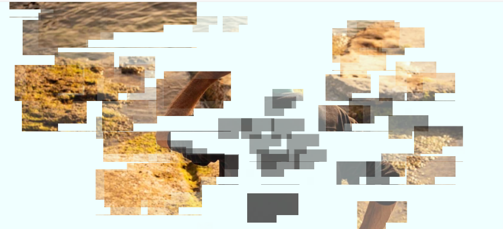
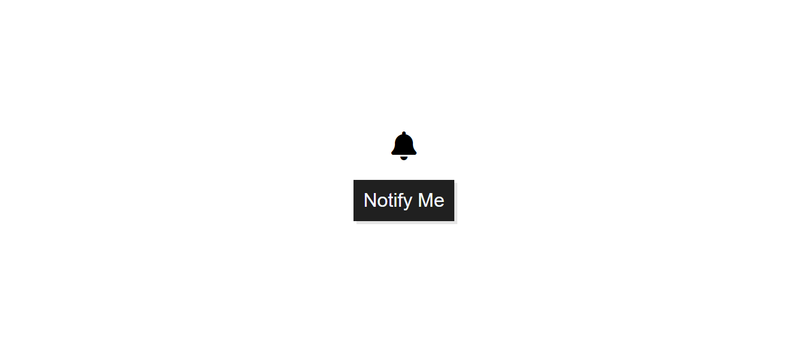
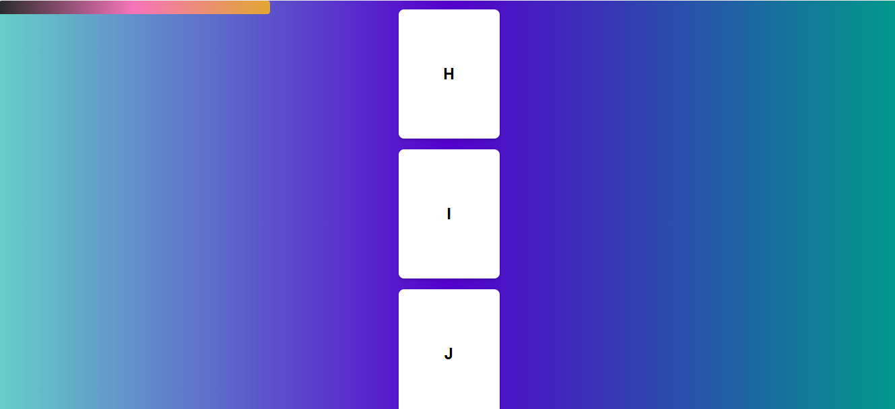
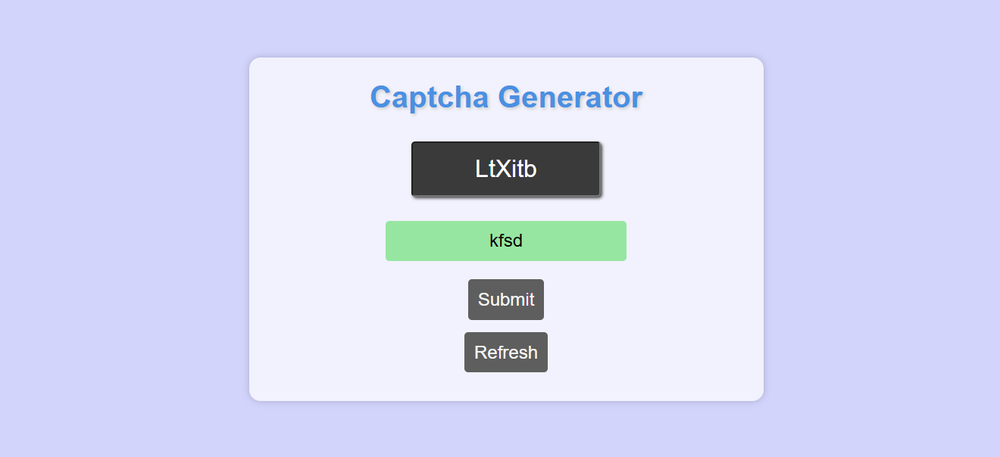
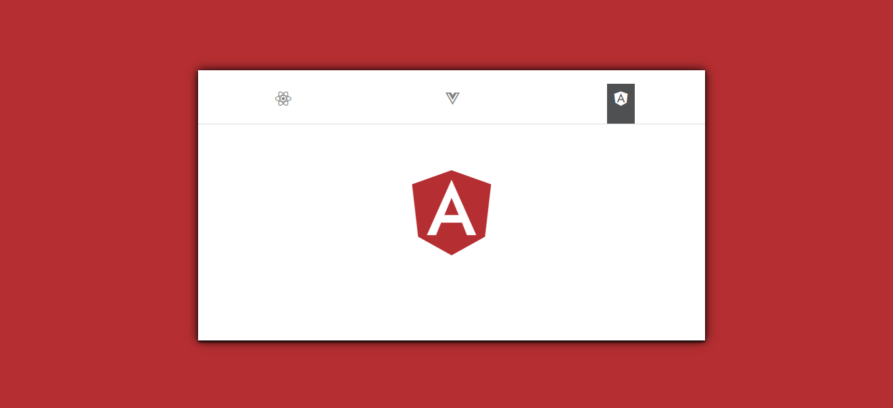
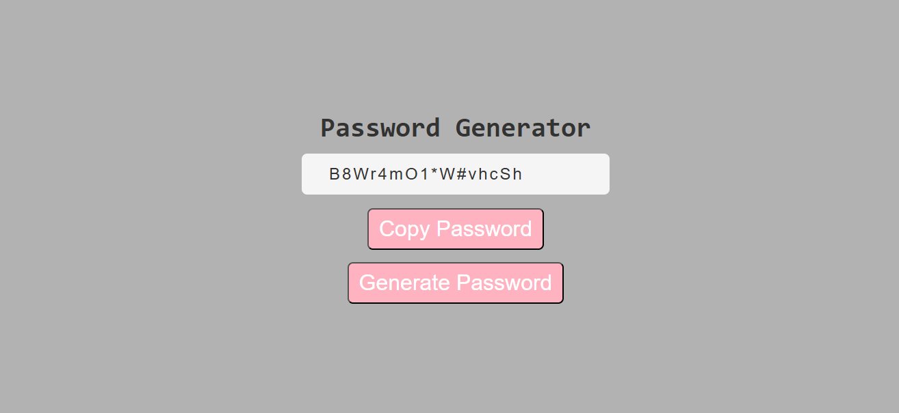

# HTML-CSS-and-JS-20-projects

### 1. Cursor Animation

#### Reference image

When hovering over the page, small portion of the background image which was initially not visible becomes visible for a few seconds.

### 2. Jumping Letters

#### Reference image

On clicking on the letters, it animate.

### 3. Bell Notification

#### Reference image

On clicking Notify Me button, the notification count increases by 1 and the bell icon gets animated.

### 4. Scrollbar Indicator

#### Reference image

On scrolling the window, the loading bar at the top of the webpage shows the total percentage height scrolled.

### 5. Captcha Generator

#### Reference image

Generates random captcha on each page load or clicking refresh. Also handles output on the basis of value entered.

### 6. JavaScript Tabs Preview

#### Reference image

On clicking different tabs, the background color as well as the main big icon changes. Also the active tab status changes which is indicated by black background color and white font color.

### 7. Password Generator

#### Reference image

New unique password generates each time on clicking "Generate Password" button and the user can also copy password the generated password on clicking "Copy Password" button.

### 8. Illumination Project

#### Reference image

On moving the mouse cursor, it creates the illumination effect and the spotlight appears only in that position where mouse is hovered

## Resources used

### 1. Pixabay

For getting HD images

### 2. font-awesome

For getting free icons