# HTML-CSS-and-JS-20-projects

### 1. Cursor Animation

#### Reference image

When hovering over the page, small portion of the background image which was initially not visible becomes visible for a few seconds.

### 2. Jumping Letters

#### Reference image

On clicking on the letters, it animate.

### 3. Bell Notification

#### Reference image

On clicking Notify Me button, the notification count increases by 1 and the bell icon gets animated.

### 4. Scrollbar Indicator

#### Reference image

On scrolling the window, the loading bar at the top of the webpage shows the total percentage height scrolled.

### 5. Captcha Generator

#### Reference image

Generates random captcha on each page load or clicking refresh. Also handles output on the basis of value entered.

### 6. JavaScript Tabs Preview

#### Reference image

On clicking different tabs, the background color as well as the main big icon changes. Also the active tab status changes which is indicated by black background color and white font color.

### 7. Password Generator

#### Reference image

New unique password generates each time on clicking "Generate Password" button and the user can also copy password the generated password on clicking "Copy Password" button.

### 8. Illumination Project

#### Reference image

On moving the mouse cursor, it creates the illumination effect and the spotlight appears only in that position where mouse is hovered.

### 9. Scratching Effect

#### Reference image

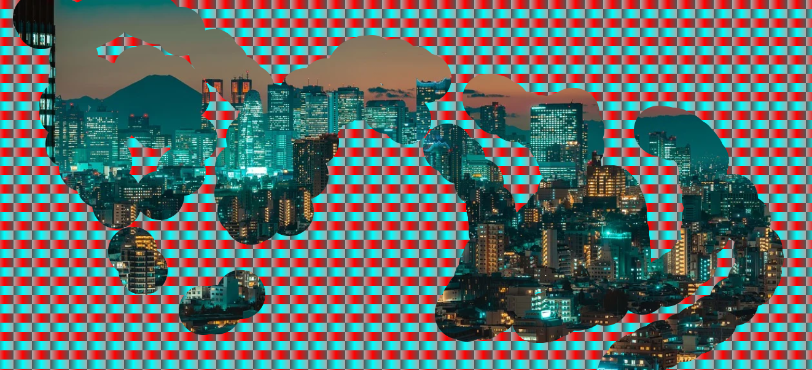

On moving the mouse cursor, it creates the scratching effect where the current background is erased and another background appears.

### 10. Disco Light Effect

#### Reference image

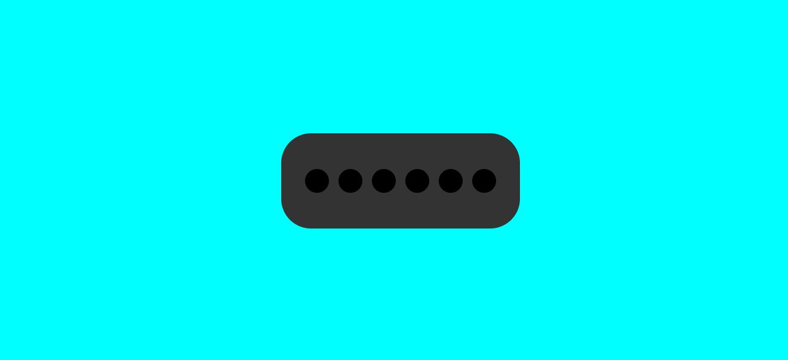

Changes the light color and background color on each one second interval where the light color matches the background color( which looks like a disco-light).

### 11. Searchbox

#### Reference image

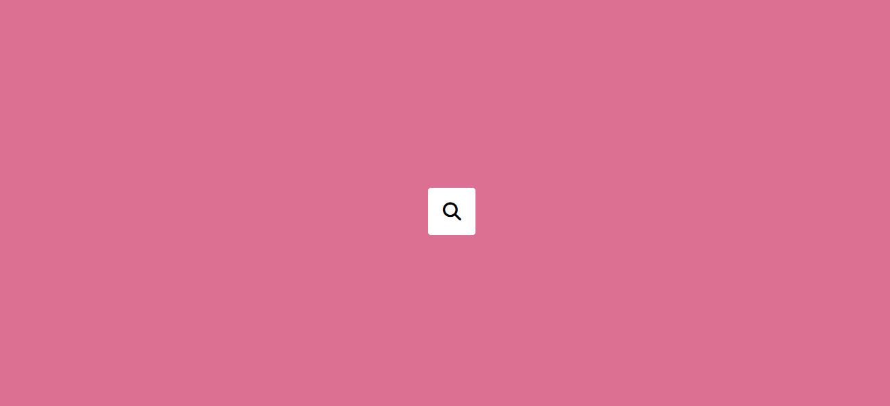
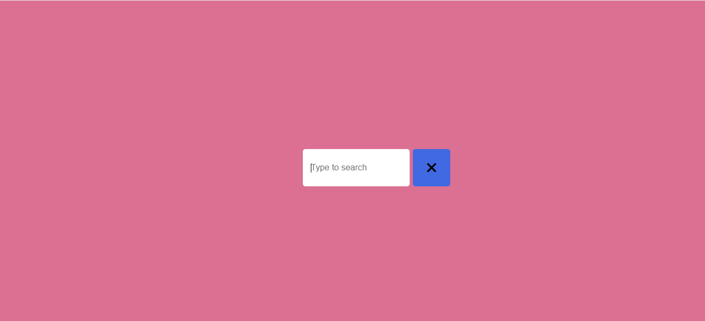

Toggles the input box on clicking the icons.

### 12. Github Contribution Clone

#### Reference image

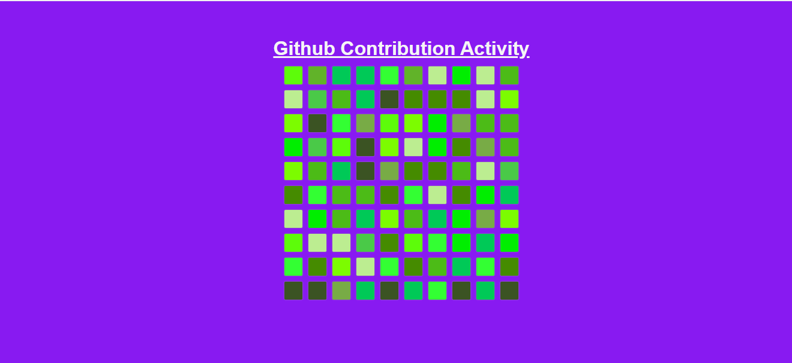

On hovering mouse on the square boxes the box-color changes and resembles like github contribution graph.

### 13. Rotating Animation

#### Reference image

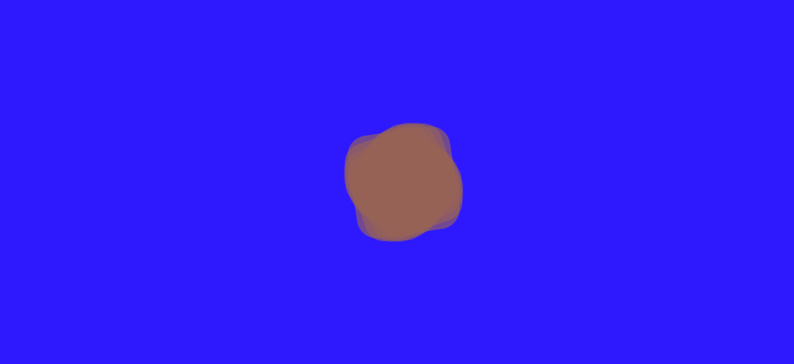

The square box rotates continuously changing its shape and size.

### 14. Currency Stack

#### Reference image

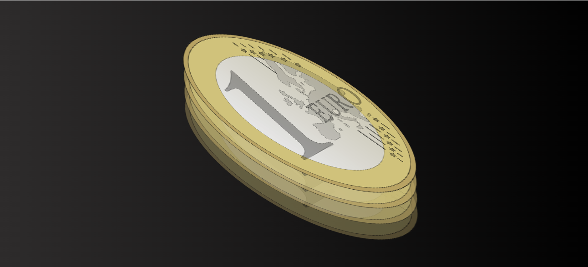

On moving mouse cursor on the window, the currency stack increases or decreases depending on direction.

### 15. Scrolling Images

#### Reference image

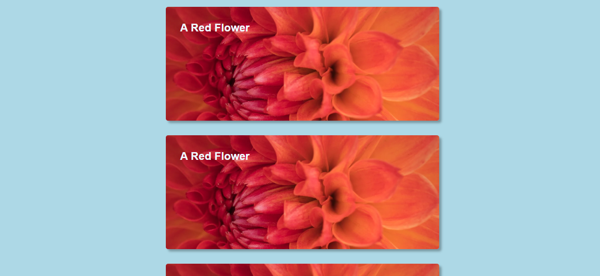

On scrolling down the window, the flower cards translates and adjusts itself at the center aligning with other cards whenever there is empty space at the bottom.

### 16. Digital Clock

#### Reference image

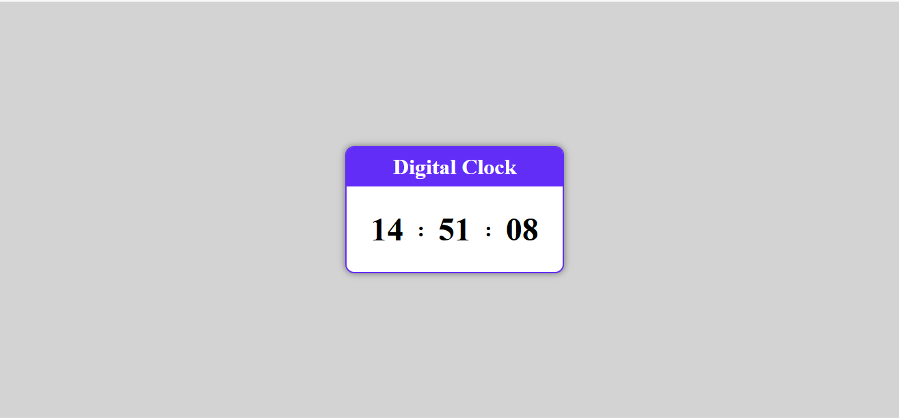

Simple Digital Clock which displays time in 24hr format.

### 16. Vowel Counter

#### Reference image

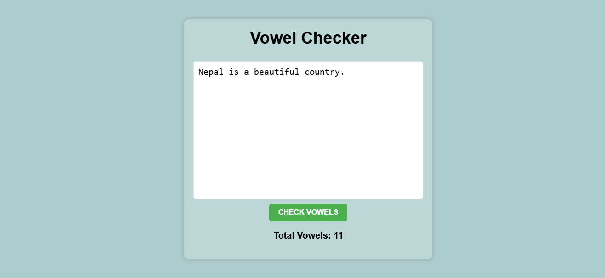

Displays the total number of vowels entered in the textarea.

### 16. Popover

#### Reference image

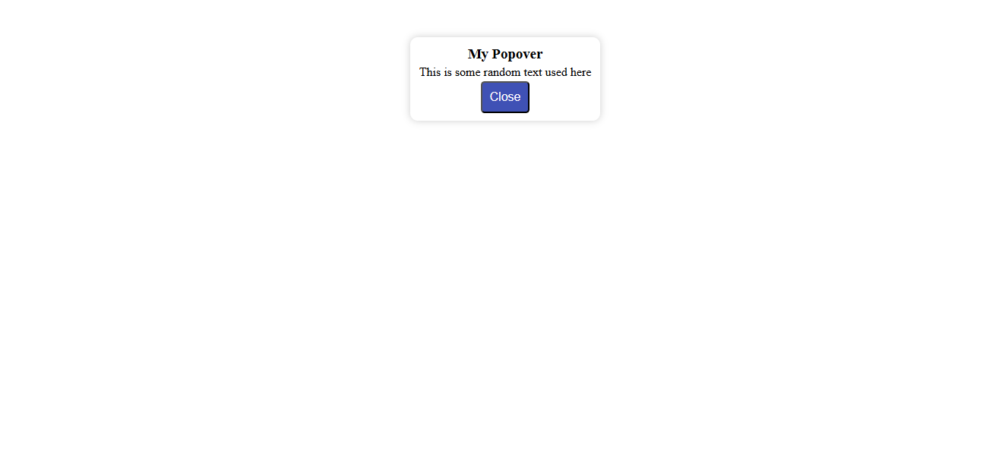

On clicking "Click Me" button, the card popover and on clicking "Close", it is removed.

## Resources used

### 1. Pixabay

For getting HD images

### 2. font-awesome

For getting free icons